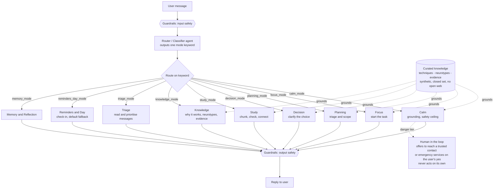

# AI Support — Architecture

One router classifies each message and sends it to one specialist mode. A curated, synthetic knowledge set grounds the support modes. Guardrails wrap input and output. Calm is the safety ceiling, and any real danger stays human-in-the-loop.

## How to read it

- **One router, many specialists.** The classifier outputs a single mode keyword. The workflow routes to the matching agent. No agent calls another agent, so one branch failing never breaks the others.
- **Knowledge layer, two ways.** The curated knowledge (support techniques, neurotypes, evidence) is built into the support modes so they ground every answer, and it also backs a dedicated Knowledge mode for explicit "why does this work" and "what is this neurotype" questions. Closed set, synthetic, no open web. This is the grounding layer that Foundry IQ would have held. See `README.md` for why IQ itself was quota-blocked.
- **Safety wraps the whole thing.** Guardrails filter input and output. Calm is the safety ceiling: any crisis routes there first. In real danger the system stays present and helps the person reach a trusted contact or emergency services on their confirmation, and never contacts anyone on its own.
- **Honest scope.** Tool modes (Triage, Reminders, Memory) use mock or synthetic data in this demo. Real integrations are on the roadmap in `README.md`.
