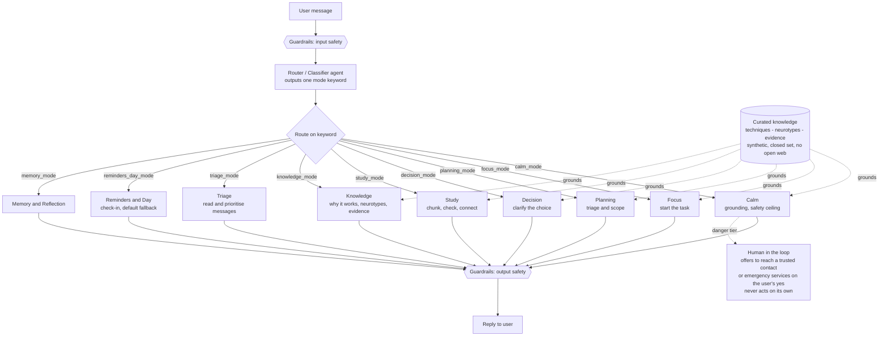

# AI Support — Architecture

One router classifies each message and sends it to one specialist mode. A curated, synthetic knowledge set grounds the support modes. Guardrails wrap input and output. Calm is the safety ceiling, and any real danger stays human-in-the-loop.

## How to read it

- **One router, many specialists.** The classifier outputs a single mode keyword. The workflow routes to the matching agent. No agent calls another agent, so one branch failing never breaks the others.
- **Knowledge layer is a live Foundry IQ knowledge base.** The curated, synthetic notes (support techniques, neurotypes, evidence) live in a Foundry IQ knowledge base, `companion-knowledge`. The Knowledge mode answers from it with cited retrieval, and the five other support modes are attached to it and look up any "why it works", neurotype, or research claim from it. Closed set, synthetic, no open web. See `README.md` for how it was built across Azure regions.
- **Safety wraps the whole thing.** Guardrails filter input and output. Calm is the safety ceiling: any crisis routes there first. In real danger the system stays present and helps the person reach a trusted contact or emergency services on their confirmation, and never contacts anyone on its own.
- **Honest scope.** Tool modes (Triage, Reminders, Memory) use mock or synthetic data in this demo. Real integrations are on the roadmap in `README.md`.
