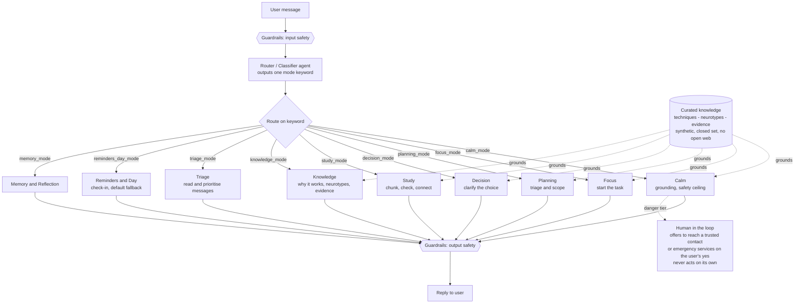
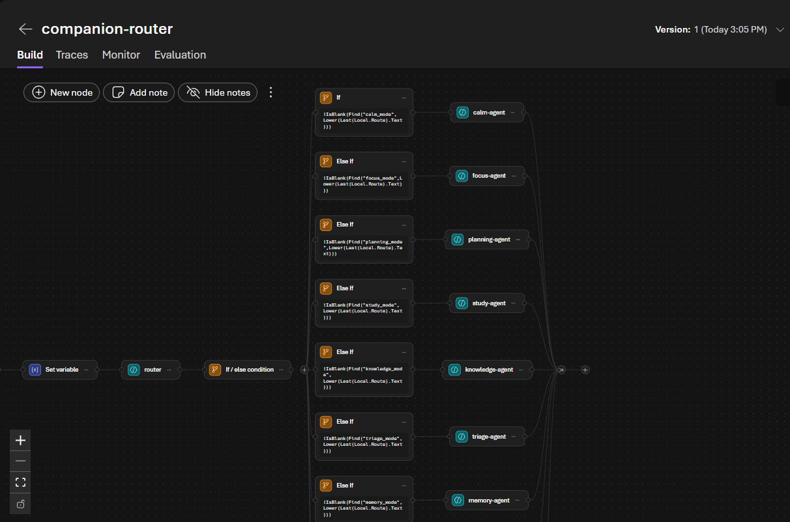
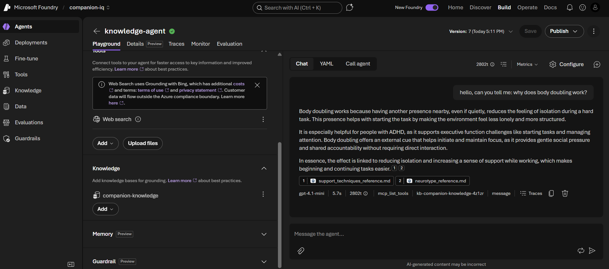

# AI Support (Companion IQ)

A multi-agent cognitive support system for neurodivergent minds, built on Microsoft Foundry for the Agents League hackathon, Reasoning Agents track. A router sends each message to one of nine specialist modes, and a Knowledge mode is grounded in a Foundry IQ knowledge base with cited retrieval.

It is an agentic offshoot of [Companion OS](https://github.com/LiinaSuoniemi/companion_os), my cognitive-support tool, rebuilt here as a multi-agent system on Foundry.

Foundry project: `companion-iq` (East US). Router workflow: `companion-router`. Track: Reasoning Agents (Microsoft Foundry). Deadline: Sunday June 14, 11:59pm PT.

## Architecture

One router classifies each message and sends it to one specialist mode. A curated, synthetic knowledge set grounds the support modes. Guardrails wrap input and output. Calm is the safety ceiling, and any real danger stays human-in-the-loop. Full notes in `ARCHITECTURE.md`.

*The `companion-router` workflow in Foundry: a classifier reads each message and routes it to one of nine specialist agents.*

## Files
- **README.md** — this overview.
- **ARCHITECTURE.md** — the system diagram and how the pieces fit.
- **agents/** — the instruction prompt for each Foundry agent:
  - `calm_IQ.txt`, `focus_IQ.txt`, `planning_IQ.txt`, `decision_IQ.txt`, `study_IQ.txt` — the five support modes, grounded by Foundry IQ.
  - `knowledge_IQ.txt` — Knowledge mode, powered by the Foundry IQ knowledge base.
  - `triage_IQ.txt`, `reminders_day_IQ.txt`, `memory_IQ.txt` — the three tool modes.
  - `router_classifier_instructions.txt` — the router that picks one mode per message.
  - `support_behavior_tail.txt`, `tool_behavior_tail.txt` — the shared behavior layer (tone, grounding, readiness and handoff, honesty rule).
- **knowledge/** — the curated, synthetic knowledge base: `support_techniques_reference.md`, `neurotype_reference.md`, `evidence_base.md`.
- **evidence/** — screenshots of the working system (router and grounded retrieval) and the deploy journey.
- **AZURE_FOUNDRY_QUOTA_LOG.md** — the full record of getting Foundry IQ working across Azure regions.

## The 9 modes
Calm, Focus, Study, Planning, Decision, and Knowledge are grounded support modes. Triage, Reminders/Day, and Memory are tool modes. A router classifies each message and sends it to one.

## Safety architecture (what the demo actually does)

Security first, both directions: protect the user from the agent, and protect the agent from bad actors.

- **Tiered escalation.** Everyday overwhelm → support and grounding (Calm). Panic → Calm grounds, body first. Active danger (accident, someone hurting them, harm to self or others) → escalation tier: the agent stays present, offers to help reach emergency services, helps prepare the call, but never dials or contacts anyone on its own. It connects only on the user's yes. Emergency text/chat offered if they cannot speak. **The AI never autonomously calls 112.** Human-in-the-loop always.
- **Location** is opt-in, emergency-only, never always-on tracking. (Demo: described; real geolocation is roadmap.)
- **Grounded on a curated, closed knowledge set, not the open web.** The agent reads only my curated, synthetic, trusted documents. This removes the prompt-injection / phishing attack surface entirely. A support tool holding private user data must not also read untrusted web content (lethal trifecta: private data + untrusted input + external action = danger). I keep those apart on purpose. See "Foundry IQ integration" below for how the grounding is implemented.
- **Foundry Guardrails.** Every agent inherits Microsoft's default content-safety guardrail (`Microsoft.DefaultV2`: jailbreak, content safety, protected materials) on input and output.
- **No yes-man.** Honest, accurate, no fake praise or fluff (the Decision mode is explicitly told not to flatter).
- **Honest about being AI.** Every agent identifies as an AI and never pretends to be human or to have feelings or a body.
- Demo tools (emergency call, trusted-contact call, calendar, profile, messages) are **mock / synthetic**. Real integrations are roadmap.

## Foundry IQ integration (working)

The required Microsoft IQ layer is a live **Foundry IQ** knowledge base. The `knowledge-agent` answers from it with grounded, cited responses.

What is wired:
- **Knowledge base:** `companion-knowledge` (in the Foundry project `companion-iq`, East US), status Active.
- **Azure AI Search:** `ai-support-iq-srch` (Central US) backs the knowledge base.
- **Knowledge source:** `support-knowledge`, File type (service-managed chunking + embedding), holding the three curated docs: `support_techniques_reference.md`, `neurotype_reference.md`, `evidence_base.md`.
- **Embedding model:** `text-embedding-3-small` (Standard).
- **Chat / synthesis model:** `gpt-4.1-mini` (Standard).
- **Retrieval reasoning effort:** Minimal. **Output mode:** Extractive. Retrieval instructions enforce grounding, citation, and no invention.
- **Agent:** `knowledge-agent` (gpt-4.1-mini) attached to the knowledge base. It returns answers grounded in the docs with a visible source citation (e.g. `support_techniques_reference.md`).

This is the Knowledge mode of the wider 9-agent system, powered by Foundry IQ. The other support modes (Calm, Focus, Planning, Decision, Study) are attached to the same `companion-knowledge` base and are instructed to look up any "why it works", neurotype, or research claim from it rather than answer from memory.

*Proof of grounded retrieval: the knowledge-agent answering "why does body doubling work", with the `kb-companion-knowledge` retrieval call and the `support_techniques_reference` and `neurotype_reference` source chips, the answer is pulled from the Foundry IQ knowledge base, not invented.*

### Getting it working: the region and auth journey

Standing Foundry IQ up on a fresh subscription was the hard part, and the lessons are worth recording:
- **Quota is region-specific, and a resource itself can be a dud.** Sweden Central had zero embedding quota (against the documented 350K default). East US 2 had quota (1M TPM) but its resource rejected every OpenAI model deploy with an opaque `715-123420` (HTTP 400). **East US** deployed cleanly, so the models live there. (Azure AI Search was at capacity in East US and East US 2, so the search service sits in Central US. Cross-region between the models and the search is fine.)
- **Free trial blocks marketplace models.** A non-OpenAI serverless embedding (Cohere) could not be purchased on a free trial. Upgrading to pay-as-you-go lifted that block.
- **Deploy via CLI, not the preview portal.** The portal's auto-deploy kept failing; `az cognitiveservices account deployment create` in East US succeeded and gave clear errors (it surfaced a deprecated `gpt-4o-mini` version, so `gpt-4.1-mini` was used instead).
- **MCP auth.** The agent first hit `401 Unauthorized` calling the knowledge base, because the search service had local (key) auth disabled. Enabling key auth (`disableLocalAuth=false`, matching Microsoft's own Bicep) fixed it.

Full step-by-step record in `AZURE_FOUNDRY_QUOTA_LOG.md`.

### Evidence

Screenshots in `evidence/` document the quota and deploy journey (Sweden Central / East US 2 walls) before the East US build succeeded:
- `01-insufficient-quota-global-standard.png` — Sweden Central, "Insufficient quota" on every embedding type.
- `02-free-subscription-cannot-purchase.png` — free subscription cannot purchase a marketplace embedding.
- `03-cohere-not-supported-allowed-models.png` — Foundry IQ accepts only `text-embedding-ada-002`, `-3-small`, `-3-large`.
- `04-no-embedding-quota-in-region.png` — the quota page showing region-specific allocation.
- `05-quota-request-form-catch22.png` — the quota-increase request form.

## Roadmap (post-hackathon, captured so nothing is lost)

- Real emergency calling (Twilio) + country-correct 112 + emergency SMS / text relay for those who cannot speak.
- Real geolocation, opt-in and emergency-only.
- **Context tool (location, time, weather, nearby places):** a shared, read-only tool any mode can call to fetch the user's local time, weather, and nearby places (maps), so Planning and Decision can give grounded, real-world help instead of guessing. Strict rules: read-only public data, location is opt-in and never always-on, and the fetch runs behind ANCHOR before any external call is combined with the support agents. This adds an external-data surface, so it stays a separate, scoped capability with its own trust boundary, consistent with the lethal-trifecta rule. Not built for the hackathon by choice. It is the kind of external-API integration that needs its own keys, billing, and safety review, so it belongs after the deadline, not before it.
- **Image / vision input:** photograph a study book or a document, transcribe it, and help the user understand it. Built for brains that process differently and overwhelm easily. As a **shared image tool** any mode can call (Study, Triage), not duplicated per mode.
- **ANCHOR — the bodyguard.** A red-team / blue-team safety agent that recognises social engineering, prompt injection, and attempts to harm or manipulate the agent. (Already a parked Companion build; this is its home.) Protects the agent so the agent can protect the user.
- Web search with an injection shield (only after ANCHOR exists; never combine open web + private data + actions without it).
- **Per-user memory profile that learns what helps each person** (what overwhelms them, what support they thrive on), so the tool improves its fit over time. The user owns it and can see, edit, and delete it. Kept strictly separate from the shared Foundry IQ knowledge base (shared curated knowledge vs private per-user data), and built with a proper privacy trust boundary. This is a deliberate continued-build direction, the project does not end at the hackathon.
- **Deepen the curated knowledge** with more evidence-informed self-regulation methods and research anchors. Grounded in research, never in branded therapy frameworks (no CBT/DBT labels), to hold the not-therapy boundary for an unlicensed support tool.

## Progress
- 2026-06-12: Built the first version in Foundry (project `ai-support`, Sweden Central) on grok, since GPT and Claude were quota-blocked there. Designed the safety architecture.
- 2026-06-13: Built and validated the multi-agent router (nine branches, including a Knowledge mode) and tuned every agent (no parroting, warmth, honesty rule, adaptivity). First Foundry IQ attempt blocked by region-specific quota and the opaque `715-123420`.
- 2026-06-14: **Foundry IQ went live.** Diagnosed the `715` as resource/region-specific with the Azure CLI, rebuilt the stack in East US (project `companion-iq`, `text-embedding-3-small` + `gpt-4.1-mini`), created the `companion-knowledge` knowledge base from the three docs, and grounded the agents in it. Fixed a `401` by enabling key auth on the search service. Verified retrieval in the trace, then published this public repo.
